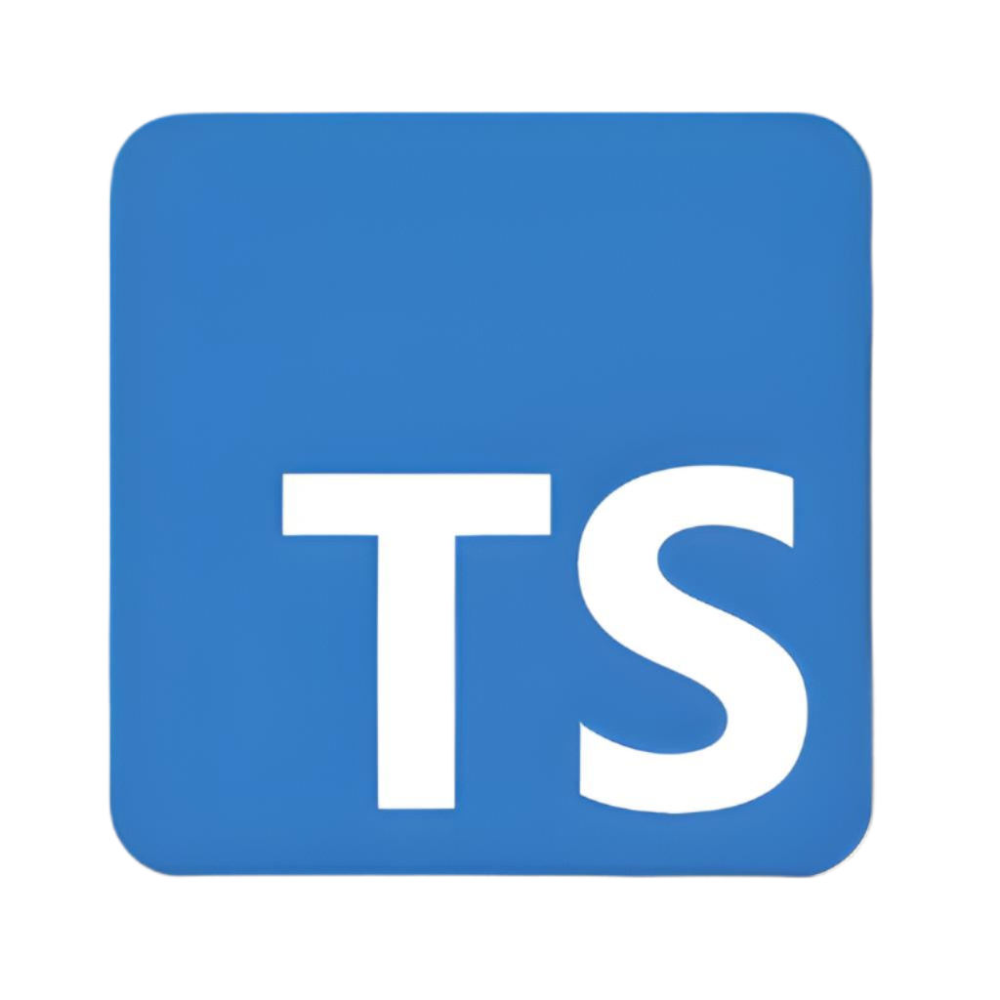

<h1 align="center">Hey there! 👋🏽 
</h1>

I'm Leo Ọládimú, a passionate software engineer specializing in full-stack development.

## 🚀 About Me
- 🔭 I'm currently working on building scalable web applications
- 🌱 I'm constantly learning and improving my skills
- 💬 Ask me about web development, cloud technologies, and software architecture

## 🛠️ Languages and Tools

  
  
  

## Connect with Me
- 💼 LinkedIn: https://www.linkedin.com/in/leooladimu/
- 📧 Email: leo@oleo.dev

---
⭐️ From [leooladimu](https://github.com/leooladimu)
